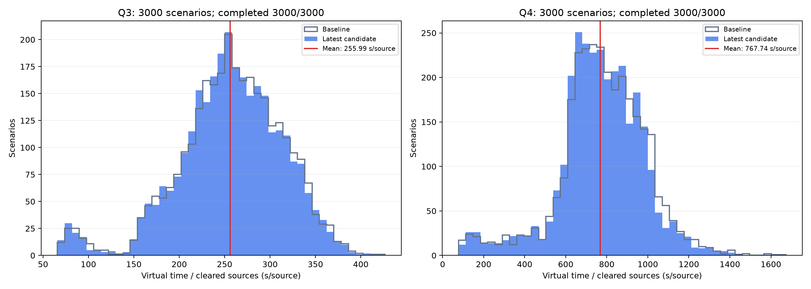

# Q3 / Q4 六小时微调后：3000 场景配对终测

每题 3000 个新场景，新旧各运行一次，共 12000 局。候选在终测前按训练验证集冻结，终测不用于调参或重新选模。使用匹配的旧 normalized-public-v2 完整系统、greedy 策略及 400 宏动作预算。

LOCAL-RESEARCH 自建模拟器结果，非官方成绩。保留实时剩余时间特征，按样例交替新旧执行顺序；不是固定墙钟输入的逐位等价实验。

| 题目 | 旧完成 | 新完成 | 旧 T/N 秒/源 | 新 T/N 秒/源 | 改善比例 | 配对差 95% CI（新−旧） |
|---|---:|---:|---:|---:|---:|---|
| Q3 | 3000/3000 | 3000/3000 | 257.155 | 255.989 | 0.453% | [-1.466, -0.865] |

## Q3 细节

平均每局虚拟耗时：3271.038 → 3255.759 秒。T/N 的 P95：343.387 → 342.280 秒/源。
更快 1379 局，持平 649 局，更慢 972 局。

候选：`/data5/hy/B-problem/runs/q3_legacy_deadline_20260913/best.pt`
SHA256：`51397bc8056798c9926ddadd9620faf7438dce29cf7b52616d82c0ed16e74679`
基线：`/data5/hy/B-problem/runs/q3_gpu8_extended_20260912/ppo/best.pt`

| N | 样例数 | 平均配对 T/N 差（新−旧，秒/源） |
|---|---:|---:|
| 10 | 438 | -1.100 |
| 11 | 453 | -0.812 |
| 12 | 397 | -1.133 |
| 13 | 426 | -1.348 |
| 14 | 432 | -1.259 |
| 15 | 416 | -1.844 |
| 16 | 438 | -0.713 |
| Q4 | 3000/3000 | 3000/3000 | 781.133 | 767.737 | 1.715% | [-15.189, -11.603] |

## Q4 细节

平均每局虚拟耗时：9863.799 → 9694.480 秒。T/N 的 P95：1097.578 → 1082.107 秒/源。
更快 1803 局，持平 133 局，更慢 1064 局。

候选：`/data5/hy/B-problem/runs/q4_legacy_deadline_20260913/best.pt`
SHA256：`e8a525f78d176d9073372394b324bd585f4445fbf9cd1515141c483f38d5bd90`
基线：`/data5/hy/B-problem/runs/q4_budget_20260912/train/best.pt`

| N | 样例数 | 平均配对 T/N 差（新−旧，秒/源） |
|---|---:|---:|
| 10 | 426 | -19.855 |
| 11 | 413 | -16.176 |
| 12 | 412 | -15.294 |
| 13 | 431 | -12.317 |
| 14 | 416 | -6.879 |
| 15 | 479 | -8.437 |
| 16 | 423 | -15.452 |

## 核验和解释

主指标是逐局 T/N 的算术平均；失败局保留并优先看完成能力。配对 95% 区间使用均值的正态近似，仅描述本研究生成器下的抽样不确定性。全部 4 份权重的 44 个运行源码文件均匹配 checkpoint 哈希；场景、噪声配置和样例种子一致，场景内容摘要逐局核验。

生产推荐文件未替换。best 是训练验证集所选快照；末轮 latest 没有用于本次终测。

[逐局 CSV](samples.csv) · [完整汇总](summary.json) · [运行及权重清单](manifest.json)
