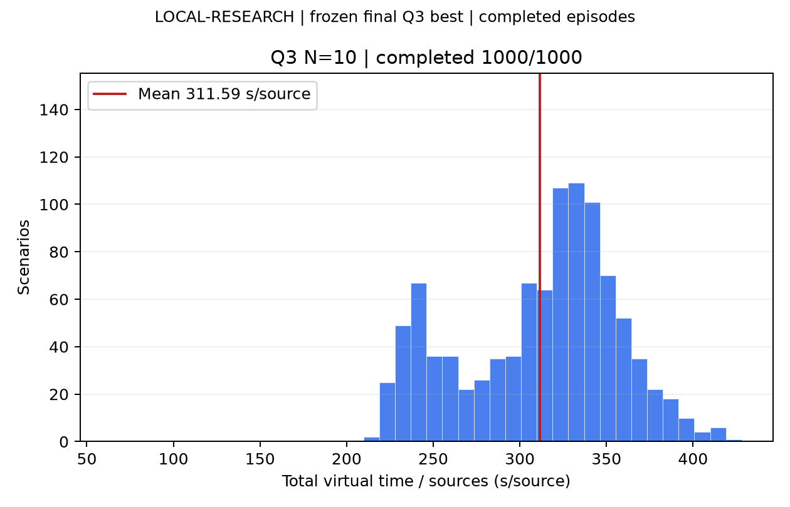
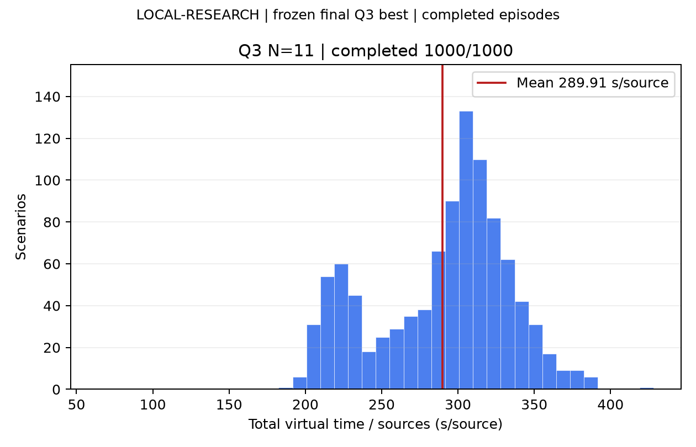
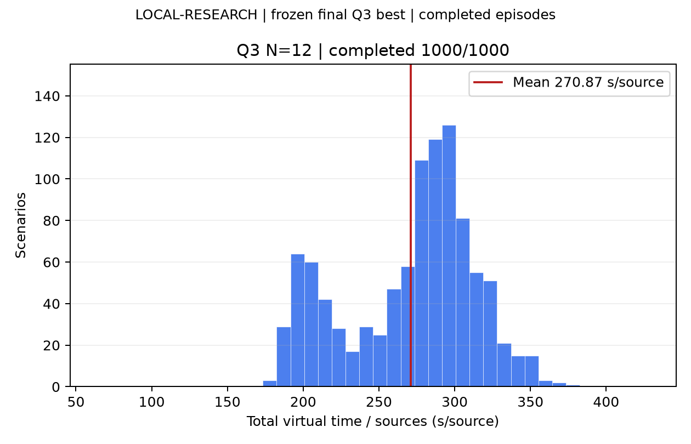
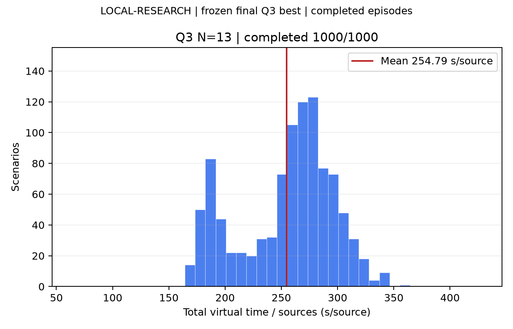
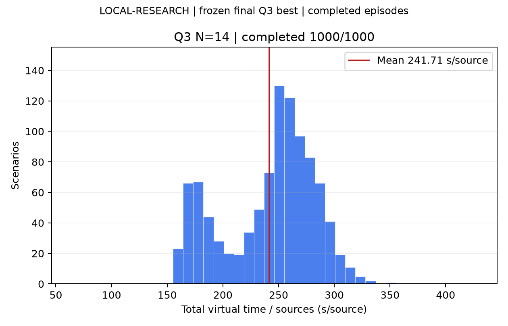
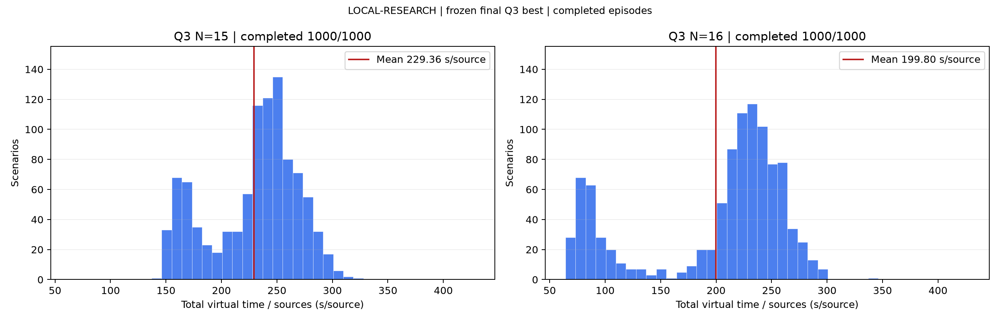

# Q3 最终 best：按干扰源数量独立测评

使用图片中 3276.62 秒/局模型及其训练时配套代码；每组使用独立 seed，源数只传给场景生成器。
这是 LOCAL-RESEARCH 结果，不是官方成绩。空间/误差分布沿用原生成器的关联混合。
Checkpoint：`/data5/hy/B-problem/runs/q3_gpu8_extended_20260912/ppo/best.pt`；SHA256：`8cc3a1621334640e6010d8d8fc2cc91a7d47a879573bd54b55fa45a990a56e71`。

| 源数 | 完成/样本 | 平均整局秒 | 平均每源秒 |
| ---- | --------: | ---------: | ---------: |
| 10   | 1000/1000 |    3115.85 |     311.59 |
| 11   | 1000/1000 |    3189.02 |     289.91 |
| 12   | 1000/1000 |    3250.48 |     270.87 |
| 13   | 1000/1000 |    3312.27 |     254.79 |
| 14   | 1000/1000 |    3383.97 |     241.71 |
| 15   | 1000/1000 |    3440.41 |     229.36 |
| 16   | 1000/1000 |    3196.86 |     199.80 |

每源均值为逐局总虚拟时间（包括搜索、测量、移动、清除、退出）除以已清除数后取平均。失败未删除；分布图仅展示完整完成局。
10–16 源共七组，以六张图展示：前五张分别为10–14源，第六张为15和16源两个独立子图。所有图使用相同分箱和纵轴。

