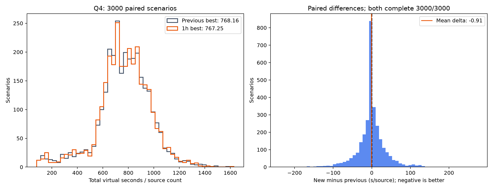

# Q4 八卡一小时续训：3000 场景配对测评

训练结束后的自动测试已完成；本报告复核并汇总已有结果，没有重复测试，也没有根据测试集重新选择 checkpoint。

结论：新模型平均耗时小幅下降，但配对 95% 置信区间包含零，尚不能确认优于原最佳基线。保留原部署推荐，同时保存新候选供进一步独立验证。

新候选：`/data5/hy/B-problem/runs/q4_baseline_8gpu_1h_20260913/train/best.pt`（验证集选出的第 600 轮，文件 update 从 0 开始为 599）。
原最佳：`/data5/hy/B-problem/runs/q4_legacy_deadline_20260913/best.pt`，与本轮 parent/best.pt 字节哈希完全一致。

| 指标 | 原最佳基线 | 一小时续训 best |
|---|---:|---:|
| 完成数 | 3000/3000 | 3000/3000 |
| 清除源数 | 39086/39086 | 39086/39086 |
| 平均整局虚拟秒 | 9697.796 | 9685.100 |
| 平均每源 T/N（秒） | 768.160 | 767.252 |
| 整局 P95（秒） | 12921.427 | 12884.488 |
| 每源 T/N 的 P95（秒） | 1070.597 | 1072.960 |

平均整局变化（新−旧）-12.696 秒，降低 0.131%；配对 95% CI [-31.853, +6.462] 秒。
平均每源变化 -0.907 秒/源，降低 0.118%；配对 95% CI [-2.304, +0.490] 秒/源。
新模型更快 1349 例、持平 356 例、更慢 1295 例。

## 按源数比较

| N | 样例数 | 原最佳平均总秒 | 新 best 平均总秒 | 新−旧（秒） |
|---:|---:|---:|---:|---:|
| 10 | 399 | 9951.39 | 9954.17 | +2.78 |
| 11 | 437 | 10126.43 | 10102.94 | -23.49 |
| 12 | 424 | 10069.52 | 10053.33 | -16.18 |
| 13 | 425 | 10131.80 | 10126.75 | -5.05 |
| 14 | 471 | 10152.92 | 10190.43 | +37.51 |
| 15 | 422 | 10110.08 | 10067.55 | -42.53 |
| 16 | 422 | 7283.32 | 7236.77 | -46.55 |

## 训练与统计口径

- 共完成 682 轮，采样 174592 个训练场景、7894324 个宏动作转移，八卡模型及 Adam 同步检查全部通过。
- 所有候选保留原规划与退出证书，没有使用 B/C/D 规划改动。best 按 512 场景验证集选择；最终第 682 轮 latest 不是本报告的候选。
- 独立测试种子 1830000000–1830002999，双方各 3000 局；逐局 seed、profile、源数一致，运行时代码 44 个文件的哈希与两份模型均一致。原评测没有保存逐场景内容哈希，本报告不声称已核对未记录的内容哈希。
- T 为包含无源确认的整局虚拟时间。每源指标先逐局计算 T/N 再平均；没有从中扣除最后清除后的耗时。原自动评测没有记录最后清除时间。
- LOCAL-RESEARCH 自建模拟器结果，不是官方成绩；默认分布与误差场 profile 关联。
- 保留原实时剩余墙钟时间特征；同一 rank 先测基线再测候选，没有采用交替执行顺序。该条件下的微小差异需谨慎解释。
- 区间使用配对均值正态近似。通过验证集选模不等于在独立测试集上也有显著改善；脚本 final_test.json 中的 recommended_checkpoint 按验证门槛填写，本报告结合测试不确定性仍建议保留原生产基线。
- 本轮测试集用于本次报告，不继续用于选训练轮次或调参。

[逐局 CSV](paired_samples.csv) · [详细汇总](summary.json) · [权重与核验记录](manifest.json)

