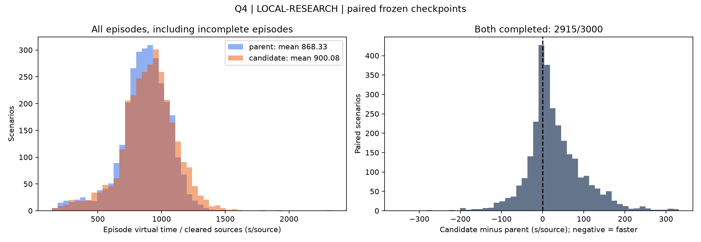

# Q4 八卡 30 分钟续训：独立配对测评

固定 3000 个新样例，seed 684000000–684002999；每个模型各运行一次。
研究模拟器随机分布，10–16 源；非官方模拟器成绩。固定 greedy 策略和 400 宏动作预算。

续训前模型：`runs/q34_structural_20260912/q4/structural_8card_restart/best.pt`，SHA256 `5bebe172834dc5e2fac92bcab251509e512fbe5d3267bba22a724b6ca8acd394`。
续训结束模型：`runs/q34_structural_20260912/q4/continue_8card_30min/latest.pt`，SHA256 `313a5d7d947bee7903bc9d9425ee527e1c754a880bbf6ed2e389ebc00eb76ed4`。

| 指标 | 续训前 parent | 续训后 candidate |
| --- | ---: | ---: |
| 完成局数 | 2948/3000 | 2932/3000 |
| 所有局平均虚拟耗时（秒） | 10954.197 | 11331.059 |
| 所有局 mean(T/C)（秒/已清除源） | 868.3254261721121 | 900.0794997640756 |
| 完整成功局 mean(T/N)（秒/源） | 865.4468606279039 | 892.7456519717301 |
| 整局 P95（秒） | 13154.549 | 14201.973 |

所有局配对差值（续训后减续训前）：376.862 秒；近似 95% CI [340.450768256136, 413.2731316931974]。

失败局全部保留；未完成局 T/C 只表示已清除源平均耗时，不能解释为找到全部源的时间。
共同成功子集统计见 summary.json；该子集有选择偏差，必须结合整体完成率判断。
策略保留每局实时剩余预算与路线搜索墙钟预算；同 seed 不保证动作逐步完全确定。
两个模型均使用相同且与 checkpoint 哈希匹配的策略/模拟器源码；交替运行顺序。
本次测试只诊断冻结模型，没有根据测试结果搜索或选择训练 checkpoint。

续训前失败原因：{'macro_budget': 52}；续训后失败原因：{'macro_budget': 68}。

## 耗时差异与失败诊断

以下为所有 3000 局的平均虚拟耗时分解，已与逐局总时间核对（误差 < 0.001 秒）。

| 时间组成（秒/局） | 续训前 | 续训后 | 后减前 |
| --- | ---: | ---: | ---: |
| 移动 | 8725.14 | 9091.03 | +365.89 |
| 测量 | 1633.32 | 1634.15 | +0.84 |
| 切换频道 | 299.82 | 296.73 | -3.09 |
| 失败清除 | 231.01 | 244.31 | +13.30 |
| 成功清除 | 64.92 | 64.84 | -0.08 |

| 源数 | 样例数 | 续训前完成 | 续训后完成 | 续训前 mean(T/C) | 续训后 mean(T/C) |
| --- | ---: | ---: | ---: | ---: | ---: |
| 10 | 409 | 409 | 408 | 1098.50 | 1138.79 |
| 11 | 428 | 424 | 420 | 1014.15 | 1041.11 |
| 12 | 415 | 407 | 405 | 939.49 | 977.23 |
| 13 | 438 | 432 | 429 | 884.37 | 916.42 |
| 14 | 456 | 450 | 446 | 824.00 | 855.43 |
| 15 | 430 | 416 | 414 | 783.66 | 811.48 |
| 16 | 424 | 410 | 410 | 546.39 | 572.94 |

训练记录显示本轮完成 191 次同步 PPO 更新，采样 12,224 局、1,044,959 个宏动作；参数和 Adam 状态同步检查通过。
训练期间所有验证点均未通过 best 更新条件，因此 latest 只是诊断对象，未替换原 best。
日志数值有限；本轮问题是性能退化，不能称为 NaN 型崩溃。移动与失败清除的统计差异描述成本来源，不能单独证明学习退化的全部因果机制。
后续应在独立开发样例上分析长 probe 链及 greedy 决策退化，并补充 KL、熵等训练诊断；本次没有继续调参或启动新训练。
