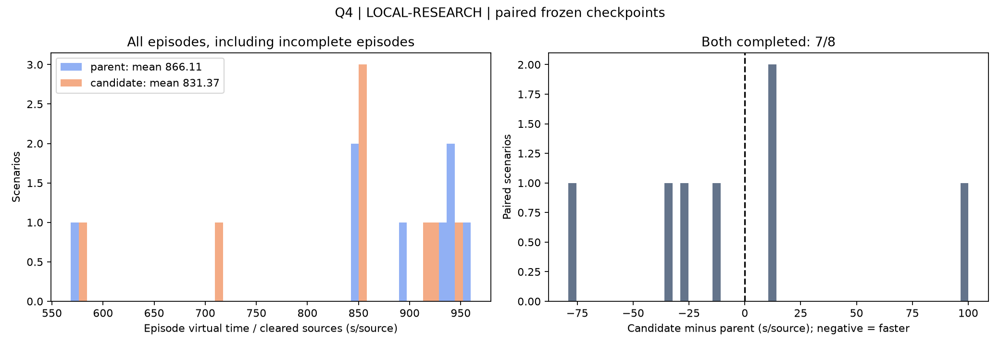

# Q4 八卡 30 分钟续训：独立配对测评

固定 8 个新样例，seed 685000000–685000007；每个模型各运行一次。
研究模拟器随机分布，10–16 源；非官方模拟器成绩。固定 greedy 策略和 400 宏动作预算。

续训前模型：`runs/q34_structural_20260912/q4/structural_8card_restart/best.pt`，SHA256 `5bebe172834dc5e2fac92bcab251509e512fbe5d3267bba22a724b6ca8acd394`。
续训结束模型：`runs/q34_structural_20260912/q4/continue_8card_30min/latest.pt`，SHA256 `313a5d7d947bee7903bc9d9425ee527e1c754a880bbf6ed2e389ebc00eb76ed4`。

| 指标 | 续训前 parent | 续训后 candidate |
| --- | ---: | ---: |
| 完成局数 | 8/8 | 7/8 |
| 所有局平均虚拟耗时（秒） | 11224.016 | 10828.071 |
| 所有局 mean(T/C)（秒/已清除源） | 866.1132631281121 | 831.3736669617242 |
| 完整成功局 mean(T/N)（秒/源） | 866.1132631281121 | 848.6487236705419 |
| 整局 P95（秒） | 12979.131 | 13457.728 |

所有局配对差值（续训后减续训前）：-395.945 秒；近似 95% CI [-1286.3417923332095, 494.4520765832094]。

失败局全部保留；未完成局 T/C 只表示已清除源平均耗时，不能解释为找到全部源的时间。
共同成功子集统计见 summary.json；该子集有选择偏差，必须结合整体完成率判断。
策略保留每局实时剩余预算与路线搜索墙钟预算；同 seed 不保证动作逐步完全确定。
两个模型均使用相同且与 checkpoint 哈希匹配的策略/模拟器源码；交替运行顺序。
本次测试只诊断冻结模型，没有根据测试结果搜索或选择训练 checkpoint。

续训前失败原因：{}；续训后失败原因：{'macro_budget': 1}。

