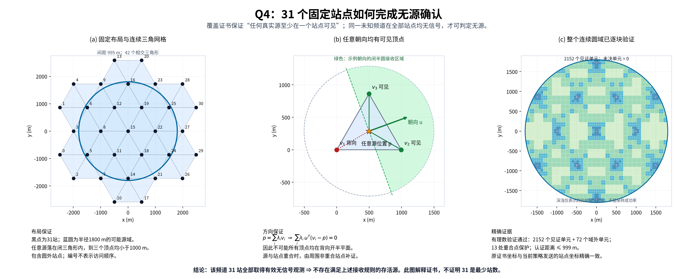

# Q4：31站全覆盖与无源确认图解



[高清PNG](coverage_certificate.png) · [矢量PDF](coverage_certificate.pdf) · [矢量SVG](coverage_certificate.svg) · [31站坐标](stations.csv) · [验证结果](verification.json)

原项目已有布局数据、三角网格论证和独立有理数证书，尚无一张把完整推理链画在一起的图。本图补齐该展示，并绑定当前最终Q4运行时：`runs/q4_baseline_8gpu_1h_20260913/train/best.pt`，SHA256 `c8812cedc2a755997dbd431873b3c4229d8411d827937225e34f1b8ac6949ffb`。这是确定性的几何证书图，不是训练效果或抽样成功率图。

## 三个子图怎样读

(a) 黑点是最终控制器实际采用的31个固定站点，编号与代码的0–30一致；蓝圆是半径1800米的可能源域。间距995米的三角网格选取42个与圆域相交的闭三角形，其顶点组成固定站点集。部分站点位于源域之外，仍参与测量。编号不表示策略的访问顺序，也不是优化后的最短路线。

(b) 任意可能源位置p落在至少一个闭三角形中。三个顶点之间距离约995米，源到各顶点距离均小于保证接收半径1000米。若源为全向源，距离条件即可保证接收；若为未知朝向u的定向源，绿色闭半圆表示一个示例朝向，至少一个非重合顶点在可见半平面内。图中展示单个位置和朝向来解释，证明覆盖任意位置和朝向。

(c) 显示既有精确证书的2152个WITNESS见证单元，深浅只代表四叉树层级。每个单元整个连续区域都由相应站点集合证明，不是只检查单元中心或随机采样。另有72个单元经精确判定完全位于源域外。2224个叶单元完整划分根正方形，未决单元为0；图只显示与圆域有关的见证区域。

## 可写入论文的核心证明

设源位置为p，发射方向为单位向量u，三角形顶点为v₁,v₂,v₃。由于p在闭三角形内，存在λᵢ≥0且Σλᵢ=1，使得

\[
p=\sum_i\lambda_i v_i,\qquad
\sum_i\lambda_i\,u^T(v_i-p)=0.
\]

若三个顶点都在背向开半平面，即所有uᵀ(vᵢ−p)<0，上式左侧严格小于0，矛盾。因此至少一个顶点满足uᵀ(vᵢ−p)≥0，且距离小于1000米，在含边界的±90°接收规则下可见。若p恰与顶点重合，不依赖该重合测量的可见性，而用其周围六个非重合邻站补证；源域内13个站点的重合保护均已通过精确验证。

有理数证书采用更一般的见证凸包：每个WITNESS单元包含于所选站点的凸包中，单元所有顶点到所有见证站点距离不超过999米。凸性将这些条件扩展到单元内全部连续位置，再使用同一内积论证覆盖任意发射朝向。认证距离保留至少1米余量。

因此，如果**同一未知频道**在全部31个认证站点都取得有效无信号观测，则假设该频道存在满足接收规则的源将与至少一个站点必可见矛盾，可以认证该频道无源。

## 适用条件与退出条件

- 源位置静止并位于半径1800米圆域，接收半径至少1000米；定向可见区域为含边界的半圆，无额外随机漏检或遮挡机制；允许在图中的圆外站点测量。
- 必须在相同频道、每个认证坐标上完成有效测量。只在站点走过，或每站只测不同的一个频道，不能得到该频道的无源证书。
- 最终代码对未发现频道累计31站负观测；认证逐频道成立。只有所有频道均已清除或已认证无源，才能退出。发现源数达到16时另有基于题目数量上限的排除规则，不依赖本图的完整遍历。
- 本图不证明31是最少站数，不证明访问顺序最优，也不保证已发现源能够在任意时限内完成定位清除。精确结论基于上述模型规则；不能从图片本身推出官方实现不存在额外数值边界差异。

## 复核结果

原证书：[layout31_proof.json](../q4_optimization_20260912/layout31_proof.json)，SHA256 `7d83d0ad068b852281897368c35d34f2bae6142b8ca8208e62d8786e3b29e32a`。

独立验证器重新返回`PROVED_MATH`：31站、2152个见证单元、72个域外单元、13处重合保护，未决0。全部判定采用`fractions.Fraction`；不是浮点栅格采样。证书有理坐标与当前控制器坐标的JSON十进制表示逐项精确一致，最终模型的44份运行源码哈希匹配。

另用实际Controller完成空频道状态检查：第30个不同站点无信号后保持UNKNOWN，第31个后变为ABSENT_CERTIFIED；只认证一个频道时不能退出，20个频道全部认证后可退出。这是状态机检查，不是新的一次官方测评或计时实验。

```bash
python scripts/plot_q4_31_station_certificate.py
python scripts/verify_q4_certificate_exact.py runs/q4_optimization_20260912/layout31_proof.json
```

推荐图注：**Q4固定31站布局及无源确认的几何依据。** (a) 31个测量站点覆盖半径1800米可能源域；(b) 凸组合与闭半平面条件保证任意朝向的定向源在至少一个非重合近邻站点可见；(c) 有理数四叉树证书覆盖整个连续源域。因此同一未知频道在全部认证站点均获得无信号观测时，可在既定接收模型下认证无源。图中编号不代表访问顺序。
