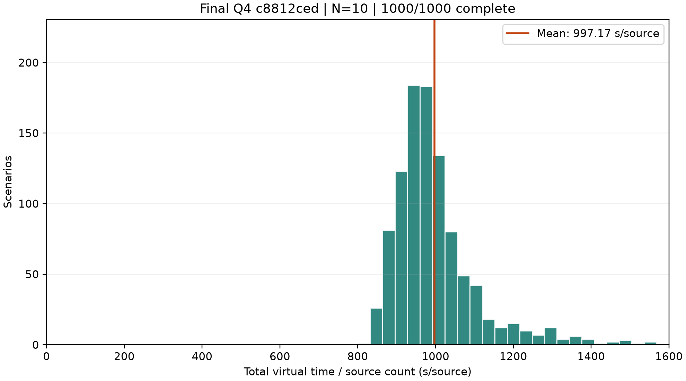
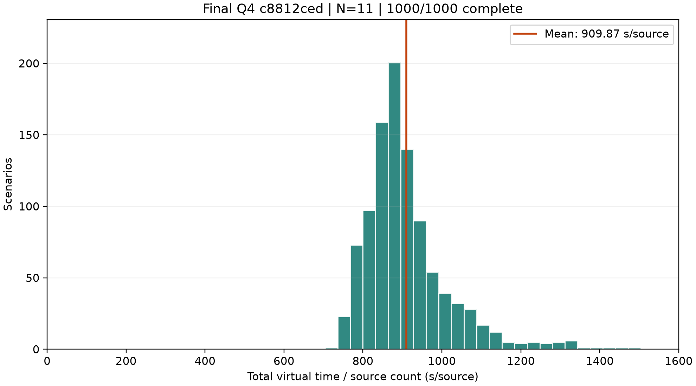
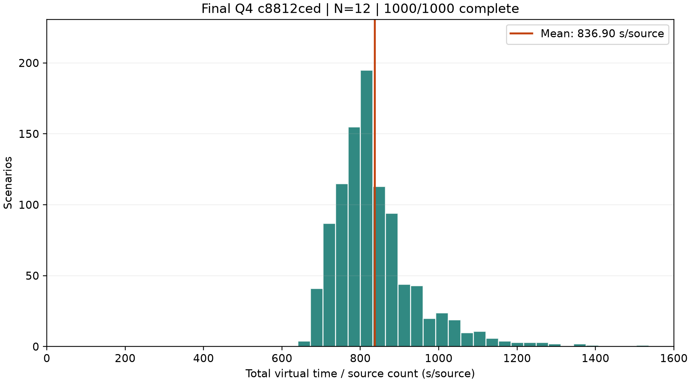
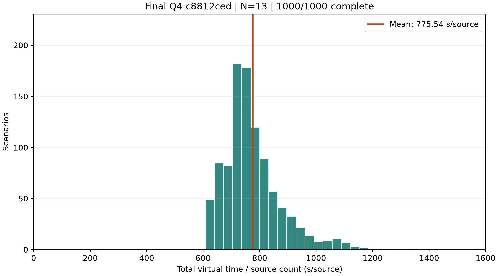
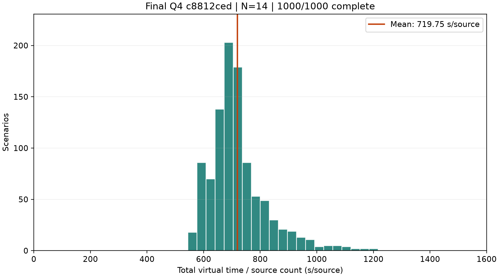
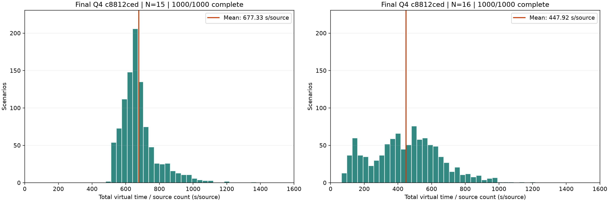

# 最终 Q4：10–16 源各1000局独立分层测评

固定模型：`runs/q4_baseline_8gpu_1h_20260913/train/best.pt`，SHA256 `c8812cedc2a755997dbd431873b3c4229d8411d827937225e34f1b8ac6949ffb`。
每组 1000 个独立种子，共 7000 局；仅评测，不训练、不据本测试重新选模。

| 源数 | 完成/样本 | 平均整局T（虚拟秒） | 平均T/N（秒/源） | T/N中位数 | T/N P95 |
|---|---:|---:|---:|---:|---:|
| 10 | 1000/1000 | 9971.69 | 997.17 | 972.43 | 1225.79 |
| 11 | 1000/1000 | 10008.59 | 909.87 | 886.45 | 1111.83 |
| 12 | 1000/1000 | 10042.79 | 836.90 | 812.99 | 1050.24 |
| 13 | 1000/1000 | 10082.01 | 775.54 | 753.99 | 982.91 |
| 14 | 1000/1000 | 10076.50 | 719.75 | 701.67 | 923.08 |
| 15 | 1000/1000 | 10160.01 | 677.33 | 656.51 | 911.06 |
| 16 | 1000/1000 | 7166.79 | 447.92 | 451.84 | 800.34 |

## 协议与解释

- 时间包含搜索、移动、换频、测量、清除与合法退出前的无源确认。主指标是逐局T/N后取平均，不是首次发现每个源的时刻。完成局T/N=T/C；失败仍保留原始记录并单报，不能将失败局短时间解释为性能改善。
- 场景采用原Q3分层实验的research-v1生成器并固定N，题目改为Q4：定向源数量在1到N−1随机，两种源并存。每组1000局时area/edge/cluster/outward各250；误差场与分布关联，沿用原协议，不能将差异只归因于位置。
- 原Q3参考实验是8cc3父模型，不是5139最终Q3；两题场景与接收规则不同，本次不是Q3/Q4逐局配对优劣检验。
- 源数只传入生成器，不提供给策略。策略仅看公开观测；评测使用greedy argmax、原实时剩余时间特征、400宏动作预算。CPU多进程执行完整参考模拟器，推理每进程单线程。
- 七组用六张主分布图展示：10–14各一张，15/16合一张双子图，与Q3图形组织一致；本次所有子图统一分箱及纵轴。分布图只绘制完整完成局。
- summary中的均值95%区间使用mean±1.96×SE，针对该关联混合研究分布，不是官方成绩区间。样本min/max为随机样本极值，不是专门搜索的理论界。
- last_successful_clear_macro_end_s为成功清除所在宏动作结束时刻的附加诊断，不声称逐请求精确最后清除时刻；本报告主指标仅使用整局T。
- 未将这7000局用于训练或验证选模；种子列表、场景内容哈希、源类型统计与运行时哈希见manifest及逐局数据。保留现实时间特征意味着跨硬件重跑不承诺逐位一致。

[统计JSON](summary.json) · [均值CSV](averages.csv) · [逐局CSV](samples.csv) · [实验协议与身份](manifest.json)

## 结果解读

10–15源平均整局耗时约9972–10160虚拟秒；16源降到7166.79秒。公开发现达到16源后可利用数量上限排除未发现频道，与低源数需要完整覆盖认证的机制不同。当前结果与此相符，但不能仅凭整局统计把时间差全归因于某一种动作。T/N下降同时包含源数增大带来的均摊作用，不代表每个源都更早被发现。

本次7000个场景均经独立重新生成并核对内容哈希，全部匹配；28局前置smoke不计入本表。
